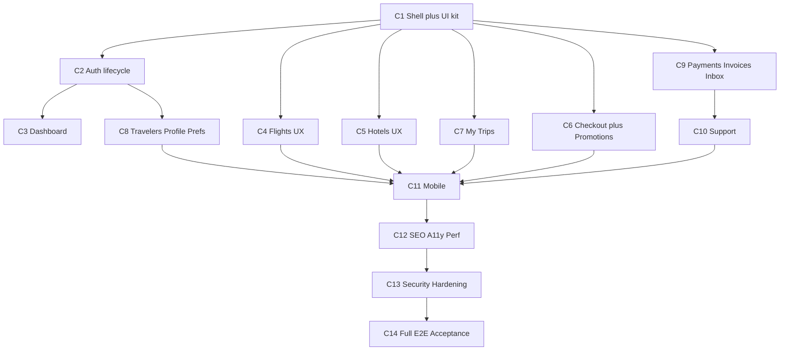

# ONETRIPS Customer Platform Roadmap

Date: 2026-08-24. Companion to [CUSTOMER-PLATFORM-AUDIT.md](CUSTOMER-PLATFORM-AUDIT.md) and [CUSTOMER-PLATFORM-GAP-ANALYSIS.md](CUSTOMER-PLATFORM-GAP-ANALYSIS.md) (gap IDs G-xx referenced throughout).

---

## 1. Current state (one paragraph)

Backend is enterprise-grade and complete behind mock providers: 23-state booking machine shared by B2C/B2B, idempotent payments with HMAC webhooks, pricing (markup/fee), ticketing + voucher + invoice PDFs, refunds with append-only ledger reversals, notification queue, RBAC, audit, rate-limited auth, CSP, backups/DR, CI with flight E2E. Customer UI covers the commerce spine (search → results → review → checkout → pay → ticket/voucher/invoice → cancel/refund) but lacks the product shell: no password recovery, no global nav/footer/mobile nav, no hotel details page, no price breakdown, no promotions, no trips organization, no payments/invoices/notifications/preferences/support pages, no SEO/content pages, weak accessibility, and the `packages/ui` kit is unused.

## 2. Target state

A single polished B2C travel marketplace on the existing architecture: complete auth lifecycle; global shell with desktop nav + mobile bottom tabs; travel dashboard; enterprise flight and hotel funnels with full filters, details, and transparent pricing; promotions; organized My Trips with premium booking detail; full account suite (travelers, profile, preferences, payments, invoices, notification inbox, security); support foundation; SEO-ready public pages; accessible, responsive, failure-state-hardened UX; E2E coverage across flight, hotel, failure, security, and mobile journeys. B2B and Admin unchanged except additive admin screens for promotions and support.

## 3. Architecture impact

- No new engines. Booking, payment, pricing, refund, ticketing engines untouched as engines; promotions plug into the existing pricing quote path; the inbox plugs into the existing notification enqueue path.
- New domain code: `packages/promotions` (evaluation + redemption), `packages/support` (requests), inbox module inside `@onetrips/notifications`, preference module inside `@onetrips/customer`, `resetPasswordWithOtp` inside `@onetrips/auth`, hotel details grouping + richer filters inside `@onetrips/hotel-search`, money helpers in `@onetrips/shared`.
- UI: shared shell + component-kit expansion in `packages/ui`; all new pages in `apps/web` (plus small additive admin pages). Business logic stays in packages; components call route handlers only.
- Conventions: Next.js 16 (`proxy.ts`, no middleware.ts; consult `node_modules/next/dist/docs/` before each phase), Tailwind v4 tokens, no Server Actions introduced unless a phase explicitly benefits and docs confirm the pattern.

## 4. Route map (customer app)

Public: `/`, `/flights`, `/flights/review`, `/hotels`, `/hotels/[hotelId]`, `/hotels/review`, `/offers`, `/destinations`, `/destination/[slug]` (C12), `/about`, `/contact`, `/faq`, `/help`, `/terms`, `/privacy`, `/refund-policy`, `/cancellation-policy`, `/login/customer`, `/signup`, `/verify`, `/forgot-password`, `/reset-password`, `/pay/sandbox` (dev), `sitemap.ts`, `robots.ts`.

Private: `/welcome`, `/account` (dashboard), `/account/trips` (+ redirect from `/account/bookings`), `/booking/[id]`, `/booking/[id]/return`, `/account/travelers` (+ redirect from `/account/passengers`), `/account/profile`, `/account/payments`, `/account/invoices`, `/account/notifications`, `/account/security` (from settings), `/account/preferences`, `/account/support`, `/support`.

Kept as-is: all existing API routes (additive endpoints only), admin and B2B apps (additive promotions/support pages in admin).

## 5. Domain and API reuse map

| Product feature | Reuses (unchanged) | New (additive) |
| --- | --- | --- |
| Auth lifecycle | `@onetrips/auth` OTP/sessions/rate limits | `resetPasswordWithOtp`; consent fields |
| Dashboard | account bookings/passenger APIs | optional aggregate endpoint |
| Flights | `@onetrips/flight-search` engine/facets | added filter fields |
| Hotels | `@onetrips/hotel-search`, `HotelProviderPort` | `getHotelDetails` grouping; filters |
| Checkout | booking/payments/pricing engines | breakdown in booking response |
| Promotions | pricing quote path, `Booking.discountAmount` | `packages/promotions` + models |
| My Trips / detail | `listBookings`, `BookingStatusHistory`, payments | status-group param |
| Travelers/profile/prefs | `@onetrips/customer` (encryption, masking) | preference module, new fields |
| Payments/invoices pages | payment queries, `@onetrips/finance` | customer-scoped list endpoints |
| Notifications | queue/templates/worker | inbox model + list/read endpoints |
| Support | notification queue, booking ownership, audit | `packages/support` + models |

## 6. Database impact (all additive; each behind an approval gate before its phase)

| Change | Models/fields | Phase | Backwards compatibility |
| --- | --- | --- | --- |
| Verification/consent | `User.emailVerifiedAt?`, `Customer.marketingConsentAt?` | C2 | Nullable; backfill `emailVerifiedAt` for existing ACTIVE users in the migration |
| Promotions | `Promotion`, `PromotionRedemption` | C6 | New tables; pricing behaves identically when no promo applied |
| Traveler extras | `SavedPassenger.isPreferred?`, `.frequentFlyerNumber?` | C8 | Nullable |
| Profile extras | `Customer` address fields, `photoUrl?` | C8 | Nullable |
| Preferences | `CustomerPreference` | C8 | New table; defaults applied when absent |
| Inbox | `InAppNotification` | C9 | New table; queue unchanged |
| Support | `SupportRequest` (+ `SupportMessage`) | C10 | New tables |

Migration plan per change: Prisma migration on PostgreSQL only; no edits to existing columns, enums extended only by addition; seed updates where needed (e.g., demo promotion in non-prod); rollback = revert migration before dependent code ships (each schema change lands in the same phase as its consumer, gated).

## 7. Security impact

- Every new customer endpoint uses `requireCustomer` + ownership scoping (`userId`/`customerId` filters), matching the existing pattern; IDOR E2E added per new surface (payments, invoices, notifications, support).
- Hardening items (C13): rate limits on cancel/refund/verify/password/writes; Origin checks on state-changing routes; upload handling moved out of `public/` with random names + validation; legacy alias routes removed; `payments/verify` zod; no OTP/passport/secret content in inbox payloads or logs.
- Promotions: transactional redemption limits; server-side evaluation only.
- Unchanged: cookies, CSP, webhook HMAC, audit, RBAC, production env asserts.

## 8. Performance impact

- Public/content pages server-rendered with static generation where possible; per-route metadata.
- Search remains Redis-session based; filters/sort stay in domain packages (no client-side re-engines).
- Shared shell keeps client JS minimal (server components by default; client components only for interactive pickers/forms — current pages are client-heavy and new pages should not copy that).
- Images through `next/image` with lazy loading; skeletons instead of spinners on list pages.

## 9. Testing strategy

- Per phase: unit tests for new domain code; integration tests for transactional logic (promo redemption, inbox writes); Playwright specs for the phase's journey; IDOR spec whenever a new customer resource type appears.
- New Playwright mobile project (Pixel-class viewport) from C11; axe accessibility checks in C12.
- C14 consolidates: full flight + hotel journeys, failure journeys (price changed, fare unavailable via `MOCK_GDS_SCENARIO`, payment declined, booking/ticketing failure, cancel, refund), security suite, mobile suite, `npm run build` for all three apps, `npm run accept`.
- Fill unit-test gaps opportunistically in packages touched (`pricing` in C6, `ticketing`/`notifications` in C9).

## 10. Implementation phases

Every phase ends with: tests + typecheck + build + relevant E2E green, report of files changed, then STOP for approval. One phase at a time.

### C1 — Customer shell, navigation, UI kit (G-04, G-05, G-06, G-26 stubs, G-28 components)
Expand `packages/ui` (Select, Modal, Tabs, Badge, Skeleton, EmptyState, ErrorState, SiteHeader, SiteFooter, AccountMenu, MobileTabBar) with a11y built in; adopt shell on all non-homepage pages (homepage visuals untouched — its header/footer links get wired to real routes only); legal/help/about/contact content pages (real routes, initial copy); footer wired.
Acceptance: shared header/footer on all customer pages except homepage design; mobile bottom tabs on customer pages; no dead `#` links anywhere; builds + existing E2E green.
Complexity: M. Dependencies: none.

### C2 — Registration, authentication, verification (G-01, G-02, G-03) [DB gate 1]
`resetPasswordWithOtp` in auth package + forgot/reset pages; rebuilt `/signup` (confirm password, T&C, privacy, optional marketing consent, proper labels/errors); standalone `/verify` with resend cooldown; `/welcome` optional profile completion with Skip; session revocation on reset.
Acceptance: full register → verify → welcome → login → reset-password E2E; enumeration-safe; rate limits verified; existing login E2E green.
Complexity: M. Dependencies: C1 shell.

### C3 — Customer dashboard (G-07)
Rebuild `/account`: hero + quick-booking tabs (flight/hotel forms), Upcoming Trip, Recent Trips, Saved Travelers, quick links (invoices, notifications, support — link targets may 404-stub until their phases).
Acceptance: dashboard renders all sections with real data; search from dashboard reaches results; mobile layout correct.
Complexity: M. Dependencies: C1, C2.

### C4 — Flight marketplace UX (G-08, G-09, G-10, G-11)
Airport autocomplete + pax/cabin on homepage form (behavior only; visual deltas require explicit sign-off); results: added filters (arrival time, duration, baggage, fare family), mobile filter drawer, multi-city modify; review: full fare breakdown + fare-family matrix.
Acceptance: filter/sort E2E incl. multi-city; breakdown shown at review; flight journey E2E green.
Complexity: L. Dependencies: C1.

### C5 — Hotel marketplace UX (G-12, G-13, G-14)
`getHotelDetails` grouping in hotel-search package; `/hotels/[hotelId]` details page (gallery, overview, rooms, amenities, policies); expanded filters + facets; destination autocomplete; richer result cards (amenities, board, policy).
Acceptance: search → details → room → review → booking E2E through existing engine; filters E2E.
Complexity: L. Dependencies: C1.

### C6 — Checkout, pricing transparency, promotions (G-15, G-16, G-33 money helper) [DB gate 2]
PriceBreakdown component at review/checkout; `packages/promotions` (evaluation inside pricing quote path, transactional redemption, release on cancel/failure); promo field at checkout; `/offers` page; admin promotions CRUD; money helpers in shared used by promo math.
Acceptance: breakdown matches ledger/invoice amounts; promo apply/invalid/expired/limit E2E; concurrent-redemption integration test; pricing unit tests added; B2B pricing unaffected (regression test).
Complexity: XL. Dependencies: C1; benefits from C4/C5 but not blocked.

### C7 — My Trips + booking detail (G-17, G-18)
`/account/trips` with Upcoming/Completed/Cancelled/Refunds tabs + trip cards; booking detail: status timeline, payments panel, cancellation policy, refund tracker; redirects from old paths.
Acceptance: tabs classify statuses correctly; timeline renders history; cancel + refund E2E journeys pass from trips.
Complexity: M. Dependencies: C1.

### C8 — Travelers, profile, preferences (G-19, G-20, G-21) [DB gate 3]
`/account/travelers` (expiry warnings, preferred, FF number); `/account/profile` (address, photo, badges); `/account/preferences` (locale, currency display, channel opt-ins, consent); `/account/security` split from settings.
Acceptance: traveler CRUD E2E incl. preferred-in-checkout; passport masking/encryption regression tests; photo upload validated.
Complexity: M. Dependencies: C2 (consent), C13-style upload hardening applied here for photos.

### C9 — Payments, invoices, notification inbox (G-22, G-23, G-24) [DB gate 4]
Customer-scoped payments + invoices list endpoints and pages; `InAppNotification` writes alongside queue sends; `/account/notifications` + header unread badge; ticketing/notifications unit tests.
Acceptance: pages render owned data only; IDOR E2E for all three; badge updates after booking events.
Complexity: M. Dependencies: C1 header (badge slot).

### C10 — Support foundation (G-25) [DB gate 5]
`packages/support`; `/help` FAQ, `/support` contact, `/account/support` request list + booking-linked creation (categories: refund, cancellation, ticket issue, hotel issue, other); admin support queue; acknowledgement notifications.
Acceptance: booking-linked request E2E; ownership verified; admin sees queue; rate-limited creation.
Complexity: M. Dependencies: C1, C9 (notifications).

### C11 — Responsive/mobile hardening (G-05 completion, G-32 mobile)
Mobile pass over funnel: filter drawers, sticky price bars, form ergonomics; Playwright mobile project; fix hamburger/menu gaps on non-homepage chrome.
Acceptance: flight + hotel booking E2E green on mobile viewport; no horizontal scroll on key pages.
Complexity: M. Dependencies: C1–C10 surfaces exist.

### C12 — SEO, accessibility, performance (G-26 full, G-27, G-34, G-28 copy pass)
Per-route metadata, sitemap/robots, OpenGraph, JSON-LD on public pages; `/destinations` + `/destination/[slug]`; axe pass + keyboard/focus fixes; message-catalog convention + locale-aware formatting helpers; image/skeleton/RSC performance pass.
Acceptance: metadata smoke tests; axe checks clean on key pages; Lighthouse-reasonable homepage/results; private routes noindexed.
Complexity: M. Dependencies: C1–C10.

### C13 — Security + failure-state hardening (G-29, G-30, G-31, G-28 states)
Rate limits on all state-changing customer endpoints; Origin checks; upload hardening; legacy alias/services cleanup (no schema drops); specific failure-state copy + alternatives CTAs (fare unavailable, price changed, room unavailable); `payments/verify` zod.
Acceptance: limit + CSRF integration tests; failure-journey E2E (GDS scenarios); no regression in flight/hotel E2E.
Complexity: M. Dependencies: all surfaces present.

### C14 — Full E2E + production acceptance (G-32 consolidation)
Complete suite: both happy paths, all failure journeys, full IDOR matrix, mobile, a11y; all builds; `npm run accept`; definition-of-done checklist from the master prompt verified item by item.
Acceptance: CI green end to end; DoD checklist signed off.
Complexity: M. Dependencies: everything.

## 11. Phase dependency graph

## 12. Risks

| Risk | Mitigation |
| --- | --- |
| Touching the locked homepage while upgrading its search form | Behavior-only changes; any visual delta screenshotted and approved first |
| Promotions introduce money bugs | Inside pricing quote path only; shared money helpers; unit + concurrent integration tests; invoice/ledger cross-checks in E2E |
| Breaking B2B/admin via shared packages | Additive-only package changes; B2B integration tests + admin build in CI every phase |
| Schema-change scope creep | All changes additive, consolidated, each behind an explicit approval gate |
| Next.js 16 conventions differ from assumptions | Read `node_modules/next/dist/docs/` guides before each phase's new patterns |
| Client-heavy page pattern copied to new pages | New pages server-first; client islands only for interactive controls |
| E2E runtime growth | Keep worker=1 spine specs; tag phase specs; full matrix only in C14/CI |

## 13. Rollback strategy

- Each phase is an independent, revertible changeset (additive routes/components/endpoints); reverting a phase does not orphan data because schema changes ship in the same phase as their only consumers.
- Schema rollbacks: additive tables/columns can be dropped by down-migration before any later phase depends on them; no destructive migrations anywhere in the plan.
- Feature-level fallback: new pages are additive routes — removing a route restores prior navigation; old paths keep redirects until stable.
- The booking/payment spine is never modified in-place, so the production funnel keeps working even if any customer-experience phase is rolled back.

## 14. Estimated complexity per phase

C1 M · C2 M · C3 M · C4 L · C5 L · C6 XL · C7 M · C8 M · C9 M · C10 M · C11 M · C12 M · C13 M · C14 M
(S = hours, M = ~1–2 days, L = ~2–4 days, XL = ~1 week of focused agent work.)
